# Diagramas ER por servicio — Caso 1 · Marketplace Almacenes Paris

Un diagrama por microservicio (una base de datos Neon por servicio, sin tablas compartidas).
Convenciones: tablas en `snake_case` plural, PK `Integer` IDENTITY, montos CLP en `int`.
Las **referencias blandas** (ids de entidades que viven en otro servicio) se marcan en el comentario
del atributo: son columnas simples sin FK física; su existencia se valida por WebClient.

---

## 1. legacy — `legacydb`

Simula el sistema antiguo. Tabla única con seed de 5.000 clientes históricos.

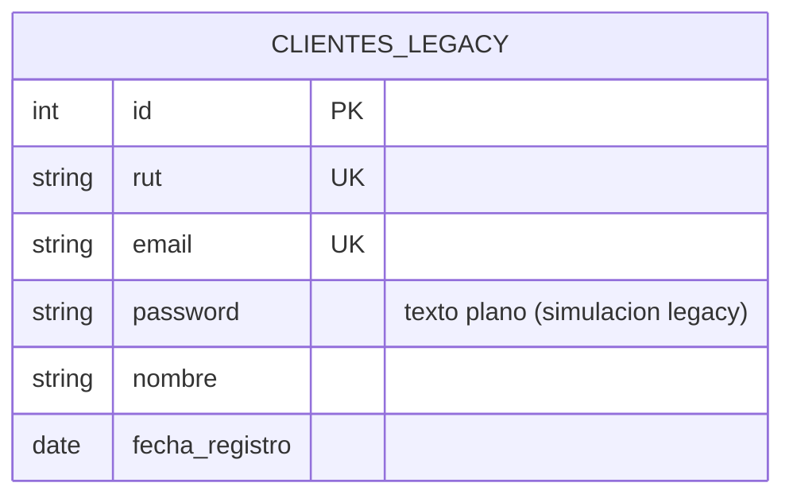

## 2. clientes — `clientesdb`

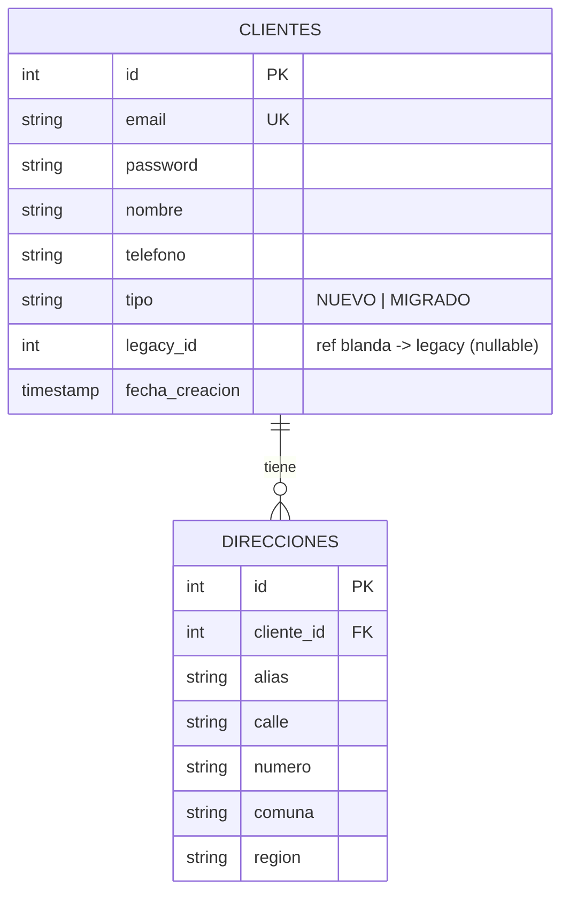

## 3. proveedores — `proveedoresdb`

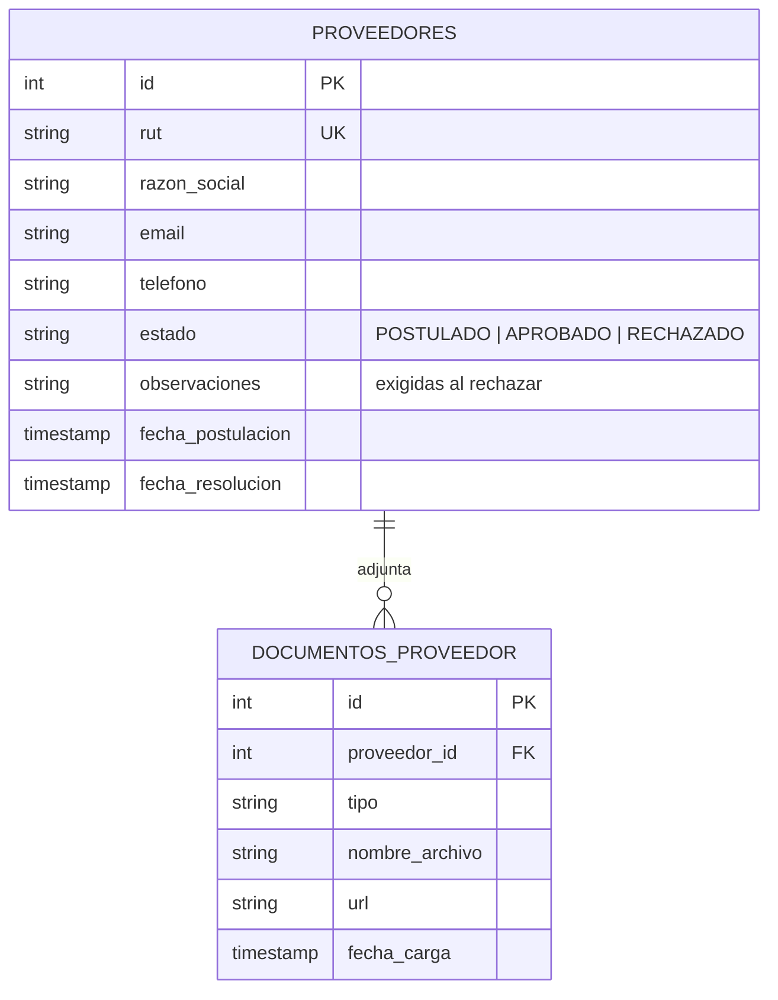

## 4. productos — `productosdb`

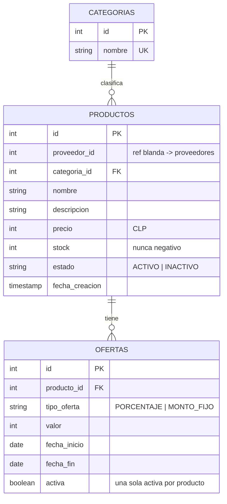

## 5. ventas — `ventasdb`

Los snapshots (nombre, categoría, precio) congelan el dato histórico de la transacción
y son el insumo del reporte semanal por categoría.

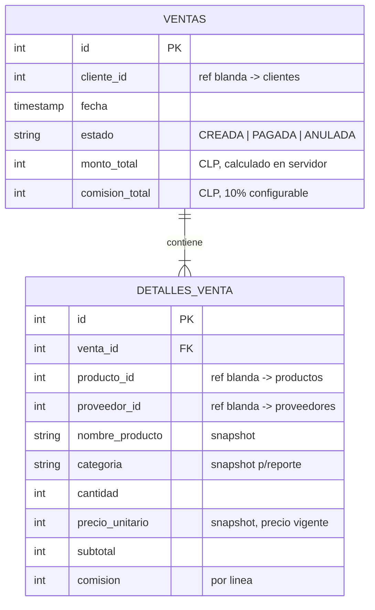

## 6. pagos — `pagosdb`

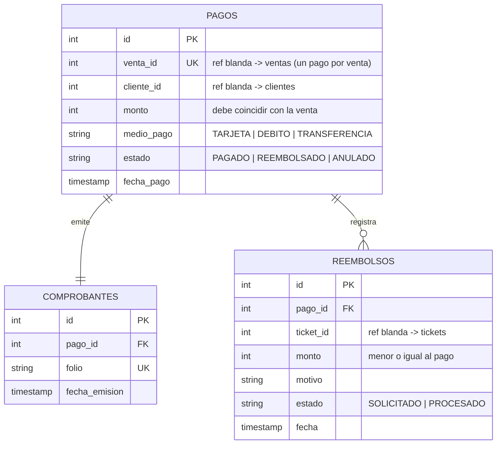

## 7. despacho — `despachodb`

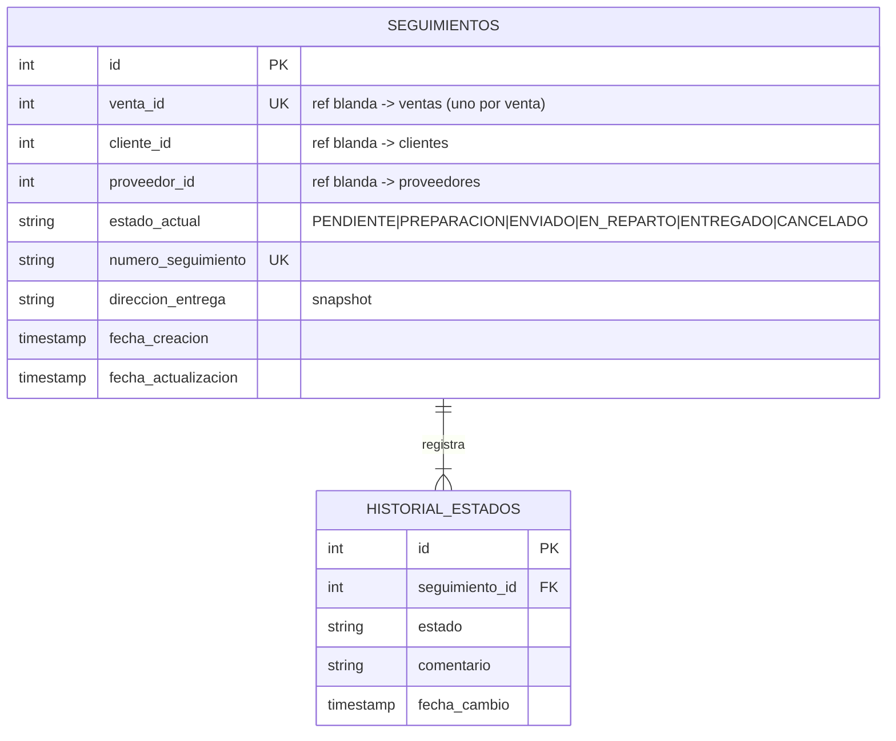

## 8. tickets — `ticketsdb`

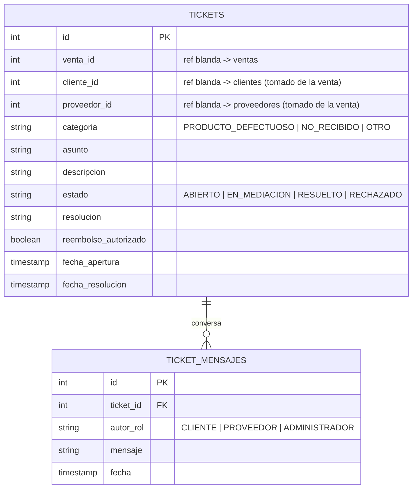

## 9. feedback — `feedbackdb`

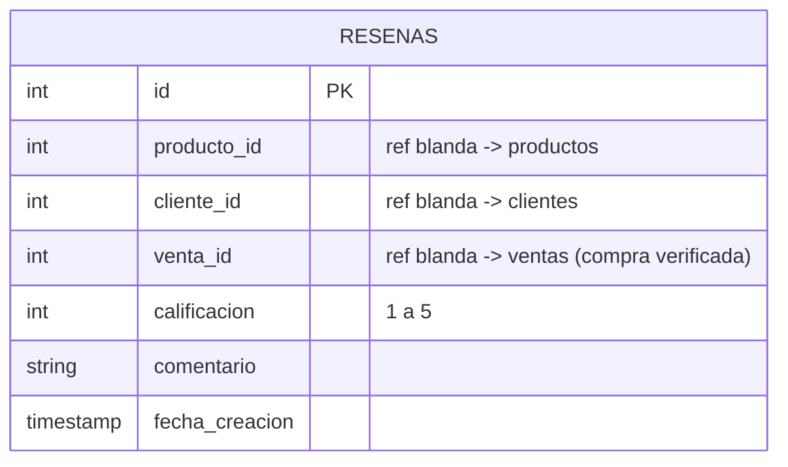

Restricción: `UNIQUE (cliente_id, producto_id, venta_id)` — una reseña por compra.

## 10. notificaciones — `notificacionesdb`

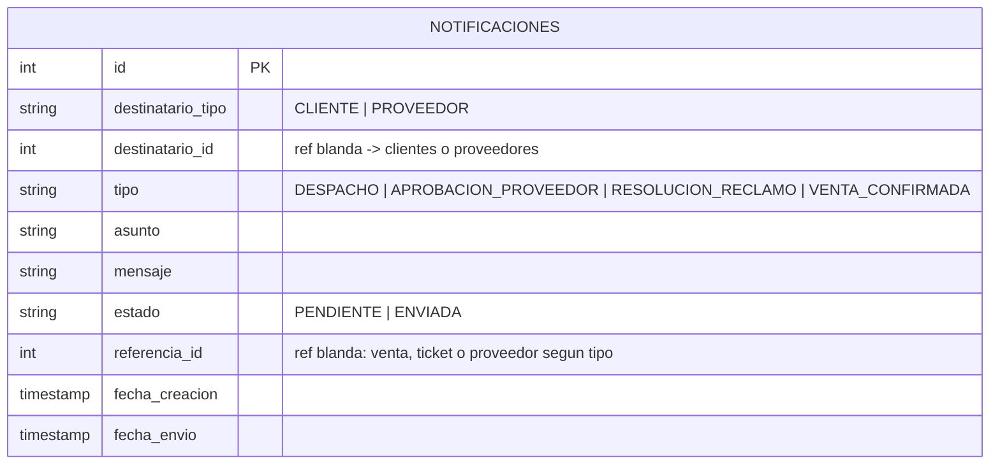

## 11. administrador — `administradordb`

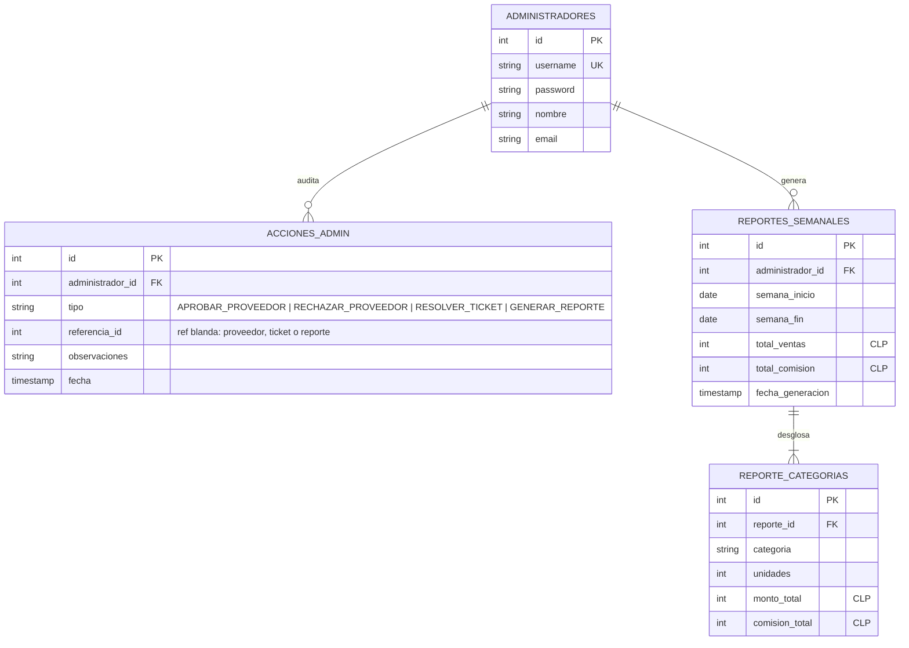
